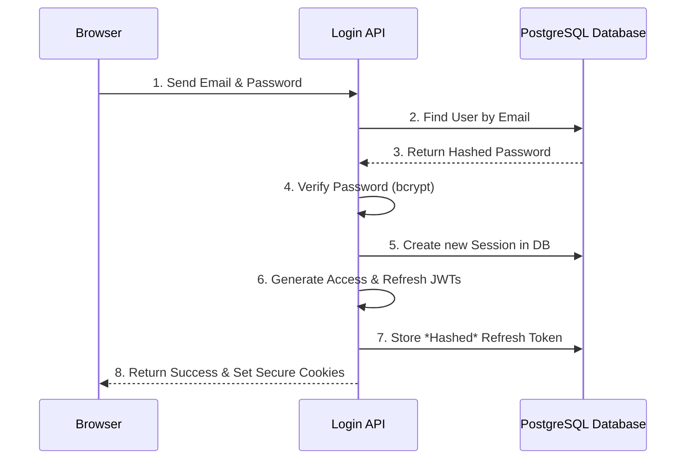
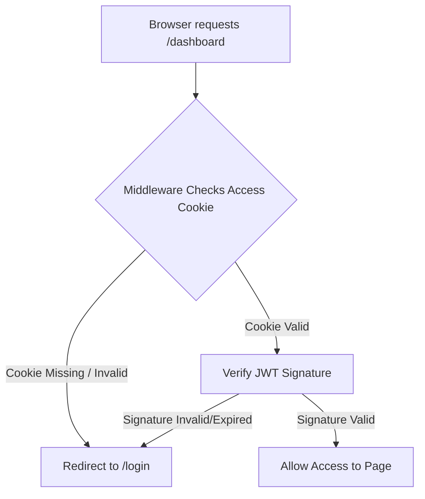
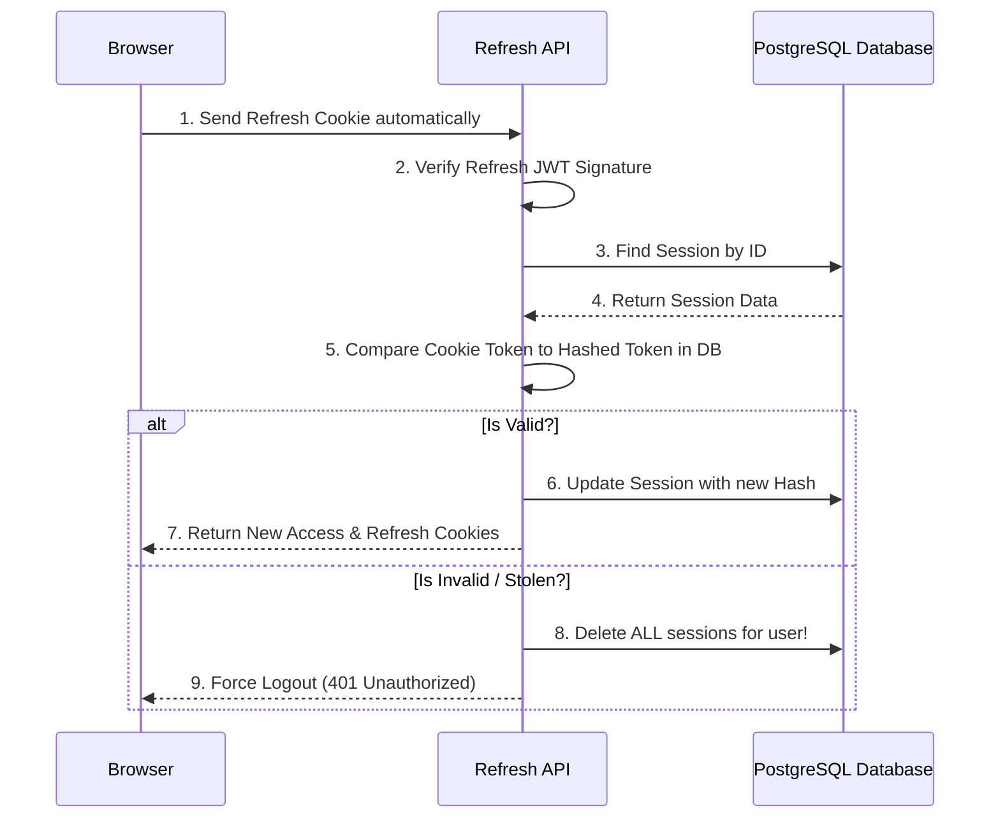

# Phase 14: Authentication System

Welcome to the documentation for the Authentication System! This document explains how the authentication flow works in simple words, complete with easy-to-understand diagrams and detailed explanations of every file involved.

---

## How It Works (The Big Picture)

We use a **Stateless JWT (JSON Web Token) approach** combined with a **Stateful Refresh Token mechanism**.

1. **Access Token (Short-lived - 15 minutes):** This token is sent with every request you make. It tells the server who you are. Because it's short-lived, even if a hacker steals it, they only have a maximum of 15 minutes to use it.
2. **Refresh Token (Long-lived - 7 days):** When your 15-minute Access Token expires, your browser silently uses the Refresh Token to ask the server for a new Access Token.
3. **Database Security:** Instead of saving the Refresh Token directly in the database, we save a **secure hash** of it using `bcrypt`. If our database is ever compromised, the hackers cannot use the stored data to break into user accounts.
4. **Token Rotation:** Every time you use a Refresh Token to get a new Access Token, the server throws away the old Refresh Token and gives you a brand new one. This ensures absolute security.

---

## Authentication Flowcharts

### 1. The Login Flow

When a user logs in, the server verifies their identity and issues two tokens securely inside `HttpOnly` cookies.



### 2. Accessing Protected Pages (Middleware)

Every time a user visits a page or API, the `middleware.ts` acts as a bouncer.



### 3. The Refresh Flow

When the short 15-minute Access Token expires, this flow runs silently in the background.



---

## Files and Code Explained

Here is a simple, detailed breakdown of every file that makes up the Authentication System.

### 1. `prisma/schema.prisma`

This file acts as the blueprint for our database.

- **What changed:** We created a `Session` model that tracks user logins.
- **Key feature:** Instead of storing raw tokens, it stores `hashedRefreshToken`. It also records `deviceInfo` (like the browser name) and `ipAddress` so users can see where they are logged in and remotely sign out of other devices.

### 2. `src/lib/auth.ts`

This is the heart of the authentication system. It contains all the core functions.

- **`hashPassword` & `verifyPassword`:** Uses `bcryptjs` to encrypt passwords safely.
- **`generateTokens`:** Uses `jose` to create JSON Web Tokens (JWTs) that work on Next.js Edge runtime.
- **`createSession`:** Stores the hashed refresh token into the database and generates cookies.
- **`refreshSession`:** Checks an old refresh token and rotates it for a new one. It protects against theft.
- **`logoutFromCurrentDevice` & `logoutFromAllDevices`:** Functions that delete the session from the database, effectively logging the user out.

### 3. `src/middleware.ts`

The middleware is the "security guard" that stands in front of your application. Every single click or request goes through here first.

- **Route Protection:** It checks for the `spm_access` cookie. If it's valid, you can see the dashboard. If not, it kicks you to `/login`.
- **Rate Limiting:** It tracks IP addresses and blocks people who spam the API (e.g., trying to guess passwords thousands of times a second).
- **CSRF Protection:** For `POST` and `PUT` requests, it makes sure the request actually came from your website and not a malicious third-party site pretending to be the user.

### 4. `src/app/api/auth/register/route.ts`

- **Purpose:** Handles new user signups.
- **How it works:** It checks if the email is already in use. If not, it hashes the password and creates the user in the database. Unlike traditional flows, it **does not** automatically create a workspace or log the user in immediately. It sets `emailVerified: false` and returns `authenticated: false`, keeping the database clean until their first actual login.

### 5. `src/app/api/auth/login/route.ts`

- **Purpose:** Handles user logins and workspace generation.
- **How it works:** It verifies the email and password. **Crucially, it handles the "First Login" logic.** If `emailVerified` is false, it updates it to true and creates the user's default Workspace on the fly. For returning users, it fetches their existing primary workspace. It then creates a Session, returns secure cookies, and sends back a rich payload including the user data, workspace data, and an `authenticated: true` flag for the frontend.

### 6. `src/app/api/auth/refresh/route.ts`

- **Purpose:** Silently renews expired sessions without bothering the user.
- **How it works:** When the frontend detects a 401 Unauthorized error (meaning the Access token died), it hits this endpoint. This endpoint takes the long-lived Refresh cookie, verifies it against the database, and issues a fresh Access token so the user never has to re-type their password.

### 7. `src/app/api/auth/logout/route.ts`

- **Purpose:** Logs the user out securely.
- **How it works:** You can tell it to log out of the current computer, or you can send `{"allDevices": true}` to log the user out of every computer and phone they have ever logged into simultaneously. It destroys the session in the database and clears the browser cookies.

---

## Why Is This "Production-Ready"?

1. **Tokens aren't stored locally:** Because we use `HttpOnly` cookies, malicious browser extensions and cross-site scripts (XSS) cannot steal your tokens.
2. **Tokens are rotated:** If a hacker intercepts your refresh token somehow, they can only use it once. The moment the actual user tries to use their token, the server will notice the duplication and instantly log everyone out, neutralizing the threat.
3. **Database is safe:** Storing hashed refresh tokens means that even if a bad actor downloads our entire database, they cannot log in as anyone because hashes cannot be reversed back into cookies.
4. **Edge Ready:** By using `jose`, our middleware runs extremely fast on Vercel's Edge networks without cold boots.

---

## How to Test APIs in Postman (Step-by-Step)

Because this system uses secure **HTTP-Only Cookies**, testing in Postman is extremely easy once you understand that Postman automatically saves and manages cookies for you. You don't need to manually copy-paste `Authorization: Bearer` headers!

### Step 1: Register a New User

Since the database is a clean slate, you must create a user first.

1. **Method:** `POST`
2. **URL:** `http://localhost:3000/api/auth/register`
3. **Headers:** `Content-Type: application/json`
4. **Body (raw -> JSON):**

```json
{
  "name": "Jane Smith",
  "email": "test@example.com",
  "password": "your-secure-password"
}
```

5. **Send:** You will get a `201 Created` status with a `redirectTo` URL. (Note: No cookies are set here).

### Step 2: Login (To get the Cookies)

Now that the user exists, log them in so Postman can save the secure tokens.

1. **Method:** `POST`
2. **URL:** `http://localhost:3000/api/auth/login`
3. **Body (raw -> JSON):**

```json
{
  "email": "test@example.com",
  "password": "your-secure-password"
}
```

4. **Send:** You will get a `200 OK` status. More importantly, click on the **Cookies** tab in Postman's response window. You will see `access_token` and `refresh_token` successfully saved by Postman!

### Step 3: View Logged-in Data (GET /me)

Now let's prove the authentication works!

1. **Method:** `GET`
2. **URL:** `http://localhost:3000/api/auth/me`
3. **Body:** _None needed!_
4. **Headers:** _No Authorization header needed!_
5. **Send:** Because Postman saved the `access_token` cookie from Step 2, the server knows who you are and will return your `id`, `name`, `email`, and a helpful `authenticated: true` flag successfully!

### Step 4: Test Refresh Flow

If you wait 15 minutes, the Access Token will expire. If you hit `/api/auth/me`, it will return a `401 Unauthorized` (or seamlessly refresh if you programmed the middleware to do so).
To manually trigger a refresh:

1. **Method:** `POST`
2. **URL:** `http://localhost:3000/api/auth/refresh`
3. **Send:** Postman will send the long-lived `refresh_token` cookie. The server will rotate it, returning a new set of cookies for Postman to save!

### Step 5: Logout

1. **Method:** `POST`
2. **URL:** `http://localhost:3000/api/auth/logout`
3. **Body (raw -> JSON):**

```json
{
  "allDevices": false
}
```

4. **Send:** The server deletes the session in the database and clears Postman's cookies. If you try to hit `/api/auth/me` again, it will fail!

---

## Token Lifecycle: Step-by-Step Overview

If you want a quick, plain-English summary of how a token lives and dies in our system, here is the complete step-by-step lifecycle:

1. **Birth (Login):** You log in. The server creates an `access_token` (lives for 15 mins) and a `refresh_token` (lives for 7 days). It hashes the refresh token, saves the hash in the database, and gives you both tokens as cookies.
2. **Usage (Access):** For the next 15 minutes, every time you click a button or load a page, the Edge Middleware checks your `access_token` cookie. It mathematically verifies the signature. If it's valid, it lets you through. The database is **never** queried during this step, making it extremely fast.
3. **Death (Expiration):** Exactly 15 minutes and 1 second later, your `access_token` expires. The Middleware now rejects your requests with a `401 Unauthorized` error.
4. **Rebirth (Refresh):** Your browser silently sends your 7-day `refresh_token` cookie to the `/refresh` API. The server looks up your session in the database and compares your cookie to the stored hash. 
5. **Rotation (Security):** The server sees the hash matches. It immediately deletes the old hash, creates a brand new `access_token` and `refresh_token`, hashes the new one, saves it, and gives you the new cookies. You are seamlessly authenticated for another 15 minutes without typing a password.
6. **Execution (Logout / Theft):** 
   - *Logout:* If you click "Logout", the server deletes your session hash from the database. Next time you try to refresh, the server finds nothing, and you are kicked out.
   - *Theft:* If a hacker stole your old refresh token and tries to use it, the server sees the signature is valid but the hash doesn't match what is currently in the database. The server instantly deletes all your active sessions everywhere, logging both you and the hacker out permanently to protect your account.
